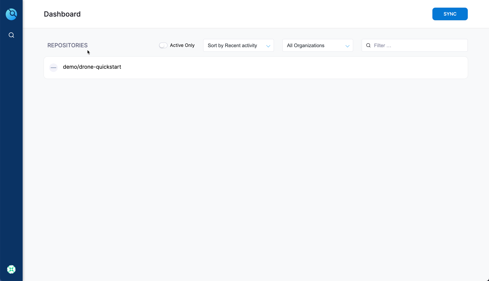
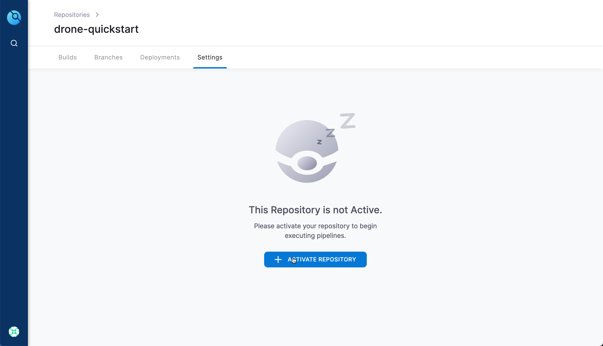
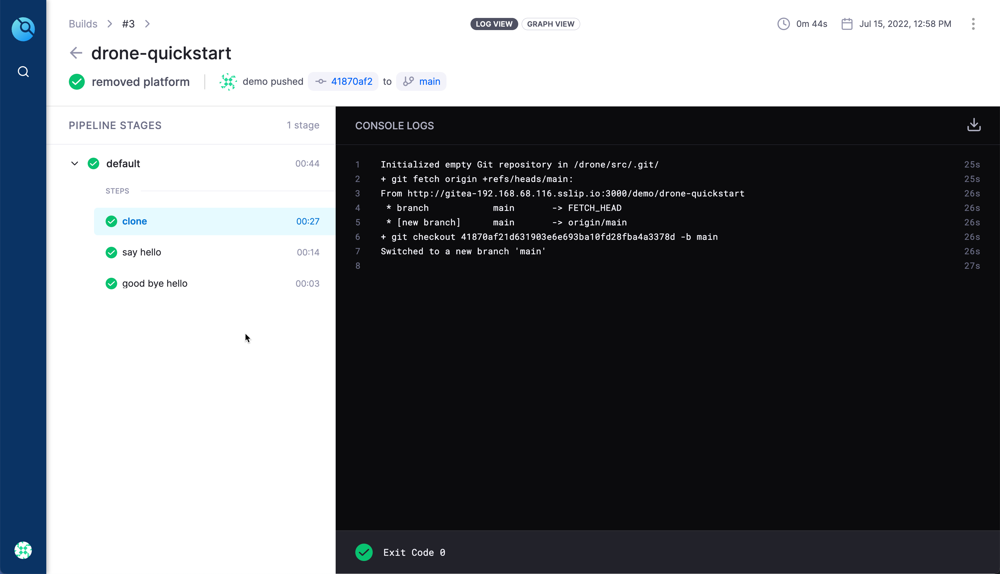

# Yours KinDly Drone

A small demo and setup to demonstrate on how to setup [Drone](https://drone.io) with local Kubernetes Cluster.

## Required tools

- Rancher Desktop for Kubernetes
- Helm
- Kustomize
- yq
- envsubst

## Create Kubernetes Cluster

```shell
./bin/kind.sh
```

## Deploy Gitea

__TODO__: Use custom namespace ??

```shell
helm repo add gitea-charts https://dl.gitea.io/charts/
helm repo update
helm upgrade --install gitea gitea-charts/gitea -f $PROJECT_HOME/helm_vars/gitea/values.yaml --wait
```

## Setup Environment

## Gitea URL

```shell
export GITEA_DOMAIN="gitea-$(kubectl get svc gitea-http -ojsonpath='{.status.loadBalancer.ingress[*].ip}').sslip.io"
export GITEA_URL="http://${GITEA_DOMAIN}:3000"
```

Update the Gitea `DOMAIN` and `ROOT_URL` to use the `gitea-http` LoadBalancer IP,

```shell
envsubst < $PROJECT_HOME/helm_vars/gitea/values.yaml | helm upgrade --install gitea gitea-charts/gitea -f -
```

You can access Gitea now in your browser using open "${GITEA_URL}"

## Drone URL

The URL where Drone Server will be deployed,

__IMPORTANT__: This value will be updated in upcoming steps. Ignore if the Drone server fails to start as upcoming steps will fix it.

```shell
export DRONE_SERVER_HOST="localhost:8080"
```

## Deploy Drone

__TODO__: Use custom namespace ??

```shell
helm repo add drone https://charts.drone.io
helm repo update
envsubst < $PROJECT_HOME/helm_vars/drone/values.yaml | helm upgrade --install drone drone/drone -f -
```

Recompute the `DRONE_SERVER_HOST`,

```shell
export DRONE_SERVER_HOST="drone-$(kubectl get svc drone -ojsonpath='{.status.loadBalancer.ingress[*].ip}').sslip.io:8080"
export DRONE_SERVER_URL="http://${DRONE_SERVER_HOST}"
```

## Configure Gitea

Configure Gitea for oAuth to be used by Drone and the demo repository that will be clone from GitHub,

```shell
./gitea-config -g "${GITEA_URL}" -dh "${DRONE_SERVER_URL}"
```

Create secrets to be used by Drone,

```shell
kustomize build $PROJECT_HOME/k8s | kubectl apply -f - 
```

Update Drone deployment with right configuration values,

```shell
envsubst < $PROJECT_HOME/helm_vars/drone/values.yaml | helm upgrade --install drone drone/drone -f -
```

You can now open the Drone Server using the url `http://drone-${DRONE_SERVER_HOST}`,

Follow the onscreen instruction to complete the registration and activate the repository `drone-quickstart` repository.


On registering and continue you should see the repo list,



Click on the repo to activate,



## Deploy Drone Runner

```shell
envsubst < $PROJECT_HOME/helm_vars/drone-runner-kube/values.yaml | helm upgrade --install drone-runner-kube drone/drone-runner-kube -f -
```

## Clone the Quickstart

Clone the `drone-quickstart` locally from Gitea and do some changes, commit and push it back to `$GITEA_URL`.

__NOTE__: The default Gitea credentials is `demo/demo@123`

The push should trigger a build in Drone and a successful build is as shown,



## Build Gitea Config Binaries

The demo uses a [util](./util/) code to configure Gitea, you can build the code using the command

```shell
./build.sh
```

The command generates a binary in $PROJECT_HOME/bin for each OS/Arch combination. Use the one that suits your OS/Arch combo.

## Clean up

```shell
helm delete drone
helm delete gitea
kubectl delete secret drone-demos-secret
```
