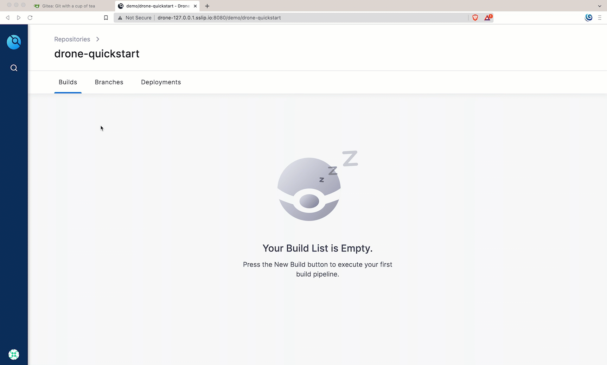
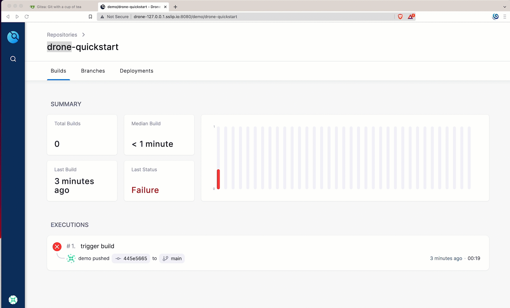

# Yours Kindly Drone

A small demo and setup to demonstrate on how to setup [Drone](https://drone.io) with [kind](https://kind.sigs.k8s.io/) as your local Kubernetes Cluster.

## Required tools

- [Docker Desktop](https://www.docker.com/products/docker-desktop/)
- [kind](https://kind.sigs.k8s.io/)
- [Helm](https://helm.sh/)
- [Kustomize](https://kustomize.io/)
- [envsusbst](https://www.man7.org/linux/man-pages/man1/envsubst.1.html)

All linux distributions adds **envsubst** via [gettext](https://www.gnu.org/software/gettext/) package. On macOS it can be installed using [Homebrew](https://brew.sh/) like `brew install gettext`.

## Create Kubernetes Cluster

```shell
./bin/kind.sh
```

## Deploy Gitea

```shell
helm repo add gitea-charts https://dl.gitea.io/charts/
helm repo update
helm upgrade \
  --install gitea gitea-charts/gitea \
  --values $PROJECT_HOME/helm_vars/gitea/values.yaml \
  --wait
```

## Setup Environment

## Gitea URL

```shell
export GITEA_DOMAIN="gitea-127.0.0.1.sslip.io"
export GITEA_URL="http://${GITEA_DOMAIN}:3000"
```

You can access Gitea now in your browser using open `${GITEA_URL}`. Default credentials `demo/demo@123`.

## Drone URL

The URL where Drone Server will be deployed,

```shell
export DRONE_SERVER_HOST="drone-127.0.0.1.sslip.io:8080"
export DRONE_SERVER_URL="http://${DRONE_SERVER_HOST}"
```

## Deploy Drone

## Configure Gitea

Configure Gitea for oAuth to be used by Drone and the demo repository that will be clone from GitHub,

```shell
$PROJECT_HOME/bin/gitea-config-darwin-arm64 \
  -g "${GITEA_URL}" \
  -dh "${DRONE_SERVER_URL}"
```

**NOTE**: Please use the right `gitea-config` binary that suits your environment. In the example above we use the macOS binary

Create secrets to be used by Drone,

```shell
kustomize build $PROJECT_HOME/k8s | kubectl apply -f - 
```

Deploy Drone,

Create namespace to deploy drone

```shell
kubectl create ns drone
```

Add drone helm repo,

```shell
helm repo add drone https://charts.drone.io
helm repo update
```

Deploy drone server,

```shell
helm upgrade --install drone drone/drone \
  --values $PROJECT_HOME/helm_vars/drone/values.yaml \
  --namespace=drone \
  --post-renderer  k8s/kustomize
  --wait
```

## Host Aliases

By default `gitea-127.0.0.1.sslip.io:3000` resolves to `127.0.0.1:3000` on the drone server pod. As we require `gitea-127.0.0.1.sslip.io:3000` to be resolved to the `gitea-http` service on the cluster we do [helm post render](https://helm.sh/docs/topics/advanced/#usage) to add [host aliases](https://kubernetes.io/docs/tasks/network/customize-hosts-file-for-pods/) to drone server deployments to resolve the `gitea-127.0.0.1.sslip.io:3000` to the `ClusterIP` of the `gitea-http` service.You can check the ClusterIP of the gitea service using the command `kubectl get svc gitea-http -n default -ojsonpath='{.spec.clusterIP}'`

As we did with drone server to resolve `gitea-127.0.0.1.sslip.ip`, we also need to update `gitea` deployment for host aliases to resolve `drone-127.0.0.1.sslip.io:8080` to resolve to `drone` service on the **drone** namespace.

This time we will use `kubectl` patch technique,

```shell
export DRONE_SERVICE_IP="$(kubectl get svc -n drone drone -ojsonpath='{.spec.clusterIP}')"
kubectl patch statefulset gitea -n default --patch "$(envsubst<$PROJECT_HOME/k8s/patch.json)" 
```

You can now open the Drone Server using the url `${DRONE_SERVER_URL}`, follow the onscreen instructions complete the registration and activate the `drone-quickstart` repo.


## Deploy Drone Runner

We need to deploy `drone-runner-kube` that will be used to run the pipelines on Kubernetes server,

```shell
helm upgrade --install drone-runner-kube drone/drone-runner-kube \
  --namespace=drone \
  --values $PROJECT_HOME/helm_vars/drone-runner-kube/values.yaml 
```

## Clone the Quickstart

Clone the `drone-quickstart` locally from Gitea, navigate to folder of your choice and run the following command,

```source
git clone http://gitea-127.0.0.1.sslip.io:3000/demo/drone-quickstart.git
cd drone-quickstart
```

If you try to make some changes to the code and push to the Gitea repo you will see the build failing as shown



### Why the build fails?

As we use [kind](https://kind.sigs.k8s.io/) as your Kubernetes cluster we need to update `.drone.yml`  **hostAliases** to point to the `gitea-http`  **ClusterIP**, otherwise the clone step of the pipeline will fail with `gitea-127.0.0.1.sslip.io` trying to connected local step pod container on port`3000`.

To get the **ClusterIP** of the `gitea-http` service run the following command,

```shell
kubectl get svc gitea-http -n default -ojsonpath='{.spec.clusterIP}'
```

Commit and push the code to Gitea to see the building getting triggered. This time build succeeds as shown,



**NOTE**: The default Gitea credentials is `demo/demo@123`

Please check the [docs](https://docs.drone.io/pipeline/kubernetes/overview/) for more configuration options.

## Clean up

```shell
 kind delete cluster --name=drone-demo
```

## Build Gitea Config Binaries

The demo uses a [util](./util/) code to configure Gitea, you can build the code using the command

```shell
./build.sh
```

The command generates a binary in $PROJECT_HOME/bin for each OS/Arch combination. Use the one that suits your OS/Arch combo.
